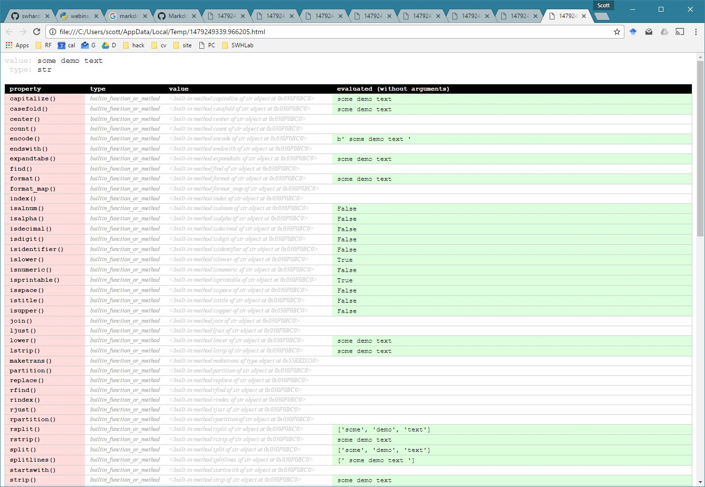
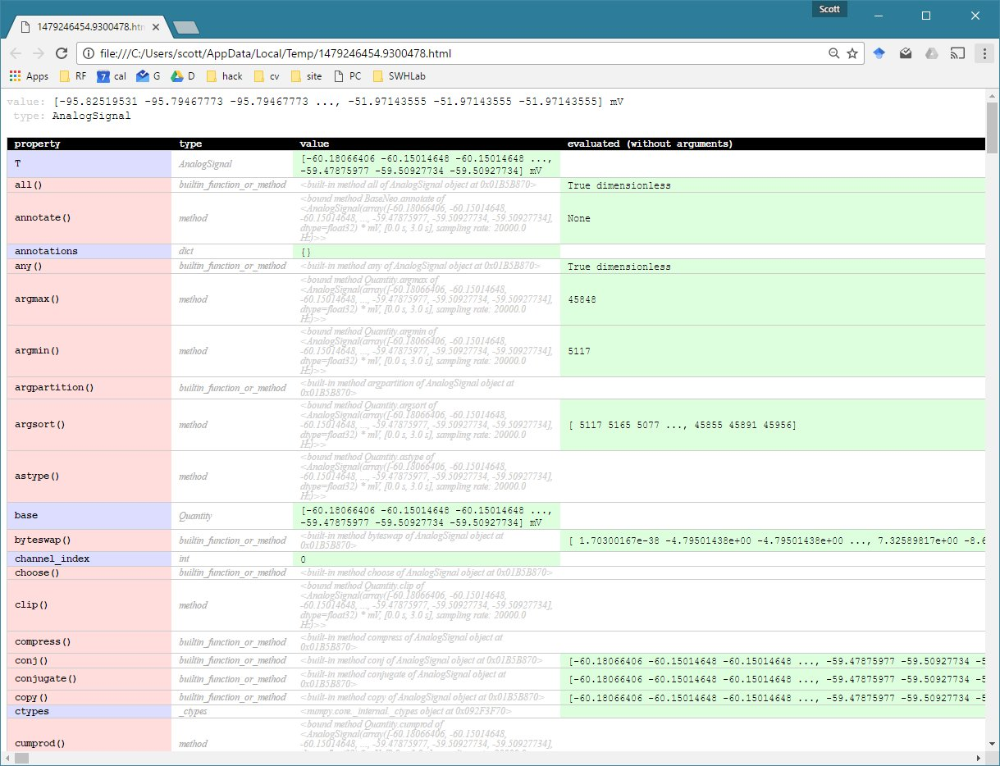

**webinspect** allows python developers to learn about objects' methods by displaying their properties in a web browser. This is extremely useful when trying to figure out how to use confusing and/or poorly documented classes. Just stick `webinspect.launch(someObject)` anywhere in your code and a web browser will automatically launch displaying all of the information about the object.

## Installation
* `pip install webinspect`
* Details are on the [PyPi/webinspect](https://python.org/pypi/webinspect) page

## Usage
```python
import webinspect
someObject=" some demo text "
webinspect.launch(someObject)
```

## Example Output (string object)


## Complex Example (neoIO AnalogSignal object)


## Complex Usage Example (exploring PyOrigin data module)
Setting `webinspect.delicate=True` prevents potentially destructive functions from being run.
```python
import imp
import PyOrigin
import numpy
import webinspect
imp.reload(webinspect)

thing=PyOrigin.ActiveLayer()
print("analyzing",thing)
webinspect.delicate=True
webinspect.launch(thing,"PyOrigin.ActiveLayer()")	

thing2=PyOrigin.WorksheetPages('EventsEpbyE7')
webinspect.launch(thing2,"WORKBOOK")	
webinspect.launch(thing2.Layers(0),"SHEET OBJECT (workbook.Layers(0))")	
```
